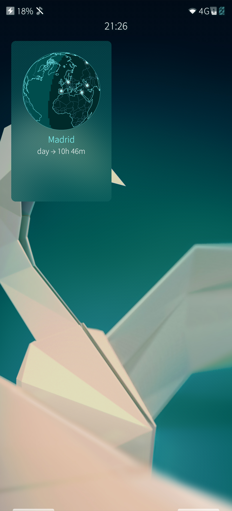
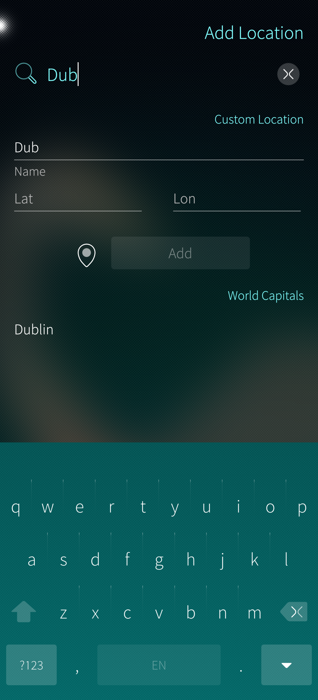
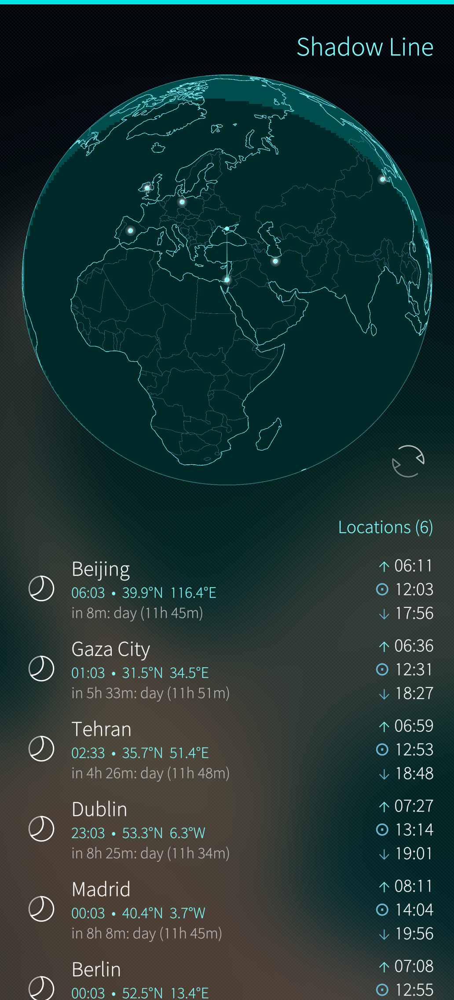
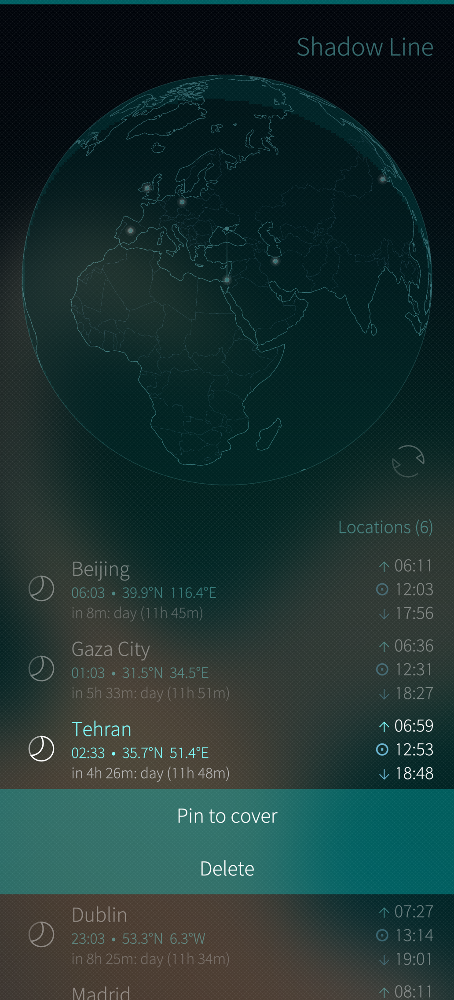

# Shadow Line

An interactive globe for Sailfish OS showing real-time day/night shading and sunrise/sunset times.

## Features

- Interactive 3D globe with coastlines, country borders, and the sun's position
- Real-time day/night shading — the terminator line updates continuously
- Add locations from a built-in list of world capitals or enter custom coordinates (GPS supported)
- Sunrise and sunset times for each saved location, refreshed every minute
- Tap a location to fly the globe to it; drag to spin freely
- Cover page shows a mini globe with a countdown to the next sunrise or sunset for a pinned location
- Polar day and polar night detection
- Solar calculations based on the NOAA Solar Calculator algorithm (±1 minute accuracy)

## License

MIT